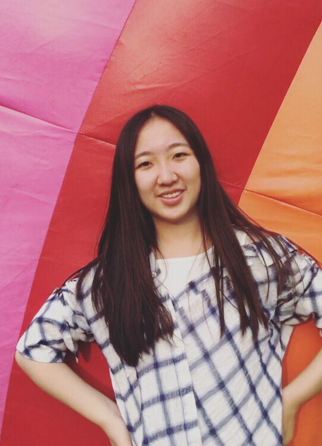
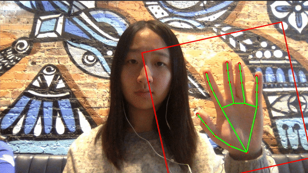

## About Me

Hi! I am a senior year student of B.S. Computer Science and B.A. Media and Journalism at the University of North Carolina at Chapel Hill.

I am currently an undergraduate research assistant at [UNC Graphics and Virtual Reality Group](http://telepresence.web.unc.edu), advised by Professor [Henry Fuchs](http://henryfuchs.web.unc.edu). I didn't fully start my research journey until my senior year. Before diving into academic research, I had experience working in both product management and advertising.

[CV](https://yujietao.me/files/Yujie_Tao_CV.pdf) / [Email](mailto:yujiet@live.unc.educ) / [Github](https://github.com/yujie-tao)

## Research Interest

My research interest is in Human-Computer Interaction, specifically in ubiquitous computing. I am passionate about new modalities of interaction between human and machines, as well as emerging interfaces.

<!-- ### Research projects -->

The research project I am currently involved in is **high-precision gaze tracking**, in which I collaborate with [Conny Lu](https://criminalking.github.io/about/), [Praneeth Chakravarthula](https://www.cs.unc.edu/~cpk/) and [Nolan Scobie](https://nolanscobie.com/). The ability to push eye-tracking accuracy forward aligns with my research interest in building the next generation of interaction between human and computing systems.

## Personal Projects
In my spare time, I work on fun projects to try out new things.

[Touchless UI](https://github.com/yujie-tao/touchless-ui) (September 2019)

I always aspire to explore interaction beyond keyboards and touch. The advances in Computer Vision allow the interaction system to be recognization based. Building upon a hand tracking model, I designed and implemented interactions to control a youtube video with hand gestures.

## Prior to Resaerch

All past experience contribute to who I am today. Both product management and advertising have cultivated me a strong awareness of design, people and computing. 

**Product** (2017~2019)

*Internship*

* **Program Manager Intern**, Microsoft, M365 Security. Mentored by Art Sadovsky and Kevin Lo.

* **Program Manager Intern**, Microsoft, Bing News. Mentored by Chen Liao.

*Selected Projects*
* [Bedside Pharmacy Mobile App](https://github.com/kylefeng28/bedside-pharmacy) -- drug reference app for trauma doctors to make medical decisions in acute situations.
* [Sublet My Room](http://www.subletmyroom.com/hello/) -- online platform to make student sublet easier.
* [iBallot](https://yujietao.me/files/iBallot_Final_Report.pdf) -- voting app to improve turn out rate of young voters in local elections.

**Advertising** (2016~2017)

*Internship*
* **Account Executive Intern**, McCANN, McCANN Health. Mentored by Verena Lam.

*Selected projects*
* [Brainbuild Quantative Research Report](https://yujietao.me/files/Brainbuild_Quantative_Research_Report.pdf) -- qualitative and quantitative research to identify target audiences for a mobile fitness startup in Bay Area.
* [Microsoft Market Report](https://yujietao.me/files/Microsoft_Industry_Report.pdf) -- scenario planning and performance dashboard to understand competitors, consumers and market potential for new products.
* [Seal the Seasons Holiday Campaign](https://yujietao.me/files/Seal_The_Seasons_Pitch.pdf) -- holiday campaigns for a local frozen food startup in North Carolina to engage with target customers.

