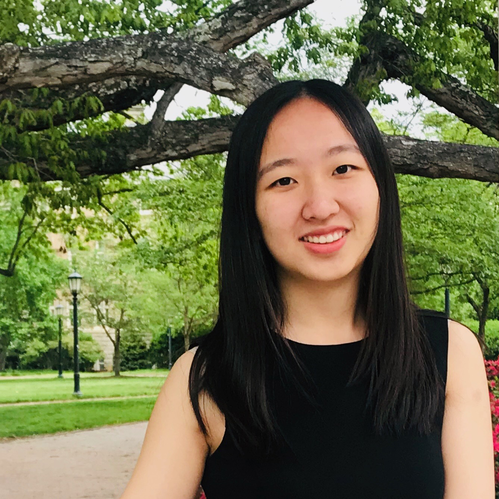

## About Me

Hi! I am a senior year student of B.S. Computer Science and B.A. Media and Journalism at the University of North Carolina at Chapel Hill.

I am currently an undergraduate research assistant at [UNC Graphics and Virtual Reality Group](http://telepresence.web.unc.edu), advised by Professor [Henry Fuchs](http://henryfuchs.web.unc.edu). I didn't fully started my research journey until my senior year. Before diving into academic research, I had experience in working in both product management and advertising.

## Research Interest

My research interest is in Human-Computer Interaction, specifically in ubiquitous computing. I am interested in new modalities of interaction between human and machine, as well as emerging interfaces.

<!-- ### Research projects -->

The research project I am currently involved in is **high-precision gaze tracking**, in which I collaborate with [Conny Lu](https://criminalking.github.io/about/), [Praneeth Chakravarthula](https://www.cs.unc.edu/~cpk/) and [Nolan Scobie](https://nolanscobie.com/). The ability to push eye-tracking accuracy forward aligns with my research interest in building the next generation of interaction between human and computing systems.

## Personal Project

This is a [link](http://google.com). Something *italics* and something **bold**.

Here is a table

Year | Award | Category
-----|-------|--------
2014 | Emmy  | Won Outstanding Lead Actor in a miniseries or a movie
2015 | BAFTA | Nominated for Best Leading Actor for Sherlock
2014 | Satellite | Won Best Actor miniseries or television film

Here is a horizontal rule

---

Here is a blockquote

> To a great mind, nothing is little

## Prior to Resaerch Experience

* Program Manager Intern, Microsoft, M365 Security
* John Doe: Associate Professor, Department of Computer Science, Ipsum
